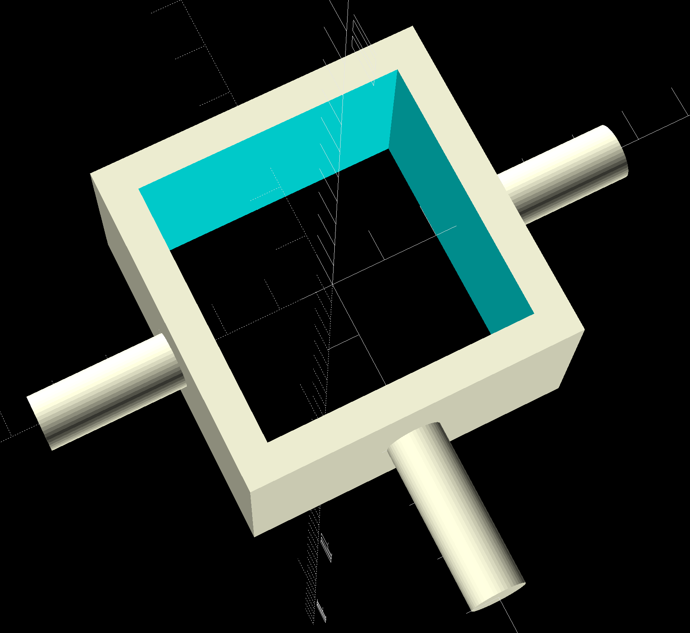
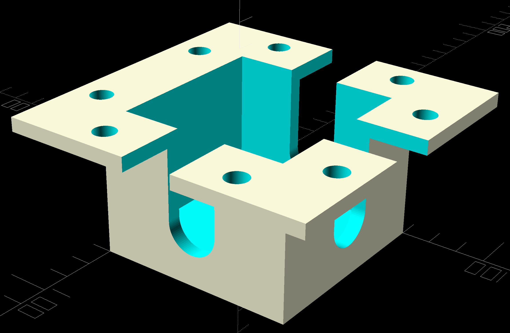

# Project: Skateboard


```DIY Electric Skateboard Conversion Kit```

---


## Create a Model:

- Board: 550mm x 200mm x 12mm

### Create a shaft

<a href="https://www.amazon.de/gp/product/B0CGHQV396">
    </a>
<a href="models/welle-fake-simple.scad">
    </a>
<a href="models/welle-fake.scad">
    </a>

### Create a shaft-holder

<a href="models/shaft-holder.scad">
    </a>
